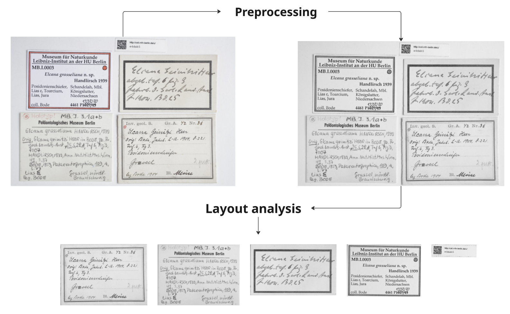
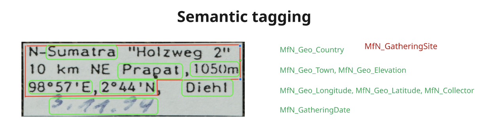

# Application Workflow for Information Extraction from Collection Labels <!-- omit in toc -->

This repository provides an application for extracting information from collection labels.

## Table of Contents <!-- omit in toc -->
- [Hardware and OS recommendations](#hardware-and-os-recommendations)
- [Prefect](#prefect)
- [Pipeline Overview and Dependencies](#pipeline-overview-and-dependencies)
  - [1. Image Preprocessing](#1-image-preprocessing)
  - [2. Layout Analysis](#2-layout-analysis)
  - [3. Text Recognition](#3-text-recognition)
  - [4. Semantic Tagging](#4-semantic-tagging)
  - [5. Entity Linking](#5-entity-linking)
- [Quickstart with example image](#quickstart-with-example-image)
  - [Prerequisites](#prerequisites)
  - [Set up local Python environment](#set-up-local-python-environment)
  - [Run app and trigger flow run from browser](#run-app-and-trigger-flow-run-from-browser)
  - [Running a flow without prefect UI:](#running-a-flow-without-prefect-ui)
  - [Run flow on own images:](#run-flow-on-own-images)
- [Evaluation Mode](#evaluation-mode)
  - [Evaluation Writer](#evaluation-writer)
- [Debug Modus](#debug-modus)
- [Dockerized application](#dockerized-application)
- [Testing (WIP)](#testing-wip)
- [Development Environment KI-Ideenwerkstatt](#development-environment-ki-ideenwerkstatt)
  - [Config behaviour](#config-behaviour)
- [Known Limitations](#known-limitations)
  - [Algorithms and Code](#algorithms-and-code)
  - [Prefect](#prefect-1)
  - [FiftyOne Database](#fiftyone-database)

## Hardware and OS recommendations
The code in this repository has been tested on Ubuntu 22.04 operating system.

The utilized GPU is a [NVIDIA A30](https://www.nvidia.com/en-us/data-center/products/a30-gpu/) unit with 24GB memory. We strongly recommend a NVIDIA GPU device with at least 16GB memory.

## Prefect
In this project [```Prefect```](https://www.prefect.io/) is used as a workflow orchestration tool to monitor tasks and pipeine runs. It provides a user interface where you get an overview of the different run and each processed image.
More about how to start the prefect server [here](#run-app-and-trigger-flow-run-from-browser).

## Pipeline Overview and Dependencies
The pipeline consist of five different steps:

1. Preprocessing
2. Layout Analysis
3. Text Recognition
4. Semantic Tagging
5. Entity Linking

The first steps of the pipeline preprocess the image and identify and divide a given image into separate regions corresponding to individual labels.



Text recognition is done on each region separately. For each region, semantic entities are recognized in the text and tagged: 



In the entity linking module, text that is tagged as denoting geographical entities, is linked whenever possible via API calls to corresponding [Geonames entries](https://www.geonames.org/).

### 1. Image Preprocessing
- **Modules**: `cv2` (OpenCV)

  OpenCV (`cv2`) is used for various image preprocessing tasks such as resizing, normalization, noise reduction, and general image transformations.

### 2. Layout Analysis
- **Modules**: `segment_anything`

   The `segment_anything` module is used to perform the image segmentation, identifying distinct regions/etickets within the image.

### 3. Text Recognition
- **Modules**: `easyocr`, `Moondream` (using Hugging Face)

   For the text recognition step, two different models are implemented, `easyocr` https://www.jaided.ai/easyocr/ and `Moondream` https://moondream.ai/.
   in the [ocr_config](./configs/ocr_config.yaml), you can set which of them to use. None of them are specifically trained to recognize handwritten text, and can be expected to perform subpar on datasets where large parts are handwritten.
   Moondream has been performing slightly better than easyocr, but easyocr runs significantly faster. Running one image through the pipeline is on average around ~15s with easyocr, and around ~35s with moondream.

### 4. Semantic Tagging
- **Modules**: `spacy` with regular expressions (`re`)

  After recognizing the text, `spacy` is used for semantic tagging using regular expressions and
  [rule based pattern matching](https://spacy.io/usage/rule-based-matching).  Which tags that are implemented with regular expression and spacy can be found in [ocr_config](./configs/ocr_config.yaml).

### 5. Entity Linking
- **Method**: API calls to [GeoNames](http://api.geonames.org/searchJSON)

  Extracted entities (e.g., place names) are linked to structured geographical data by making API requests to the GeoNames service.

## Quickstart with example image
### Prerequisites

Tested on Ubuntu 22.04 distribution!

Install linux related dependencies:
```
sudo apt update
sudo apt install -y ffmpeg libsm6 libxext6 curl libcurl4
```

<!-- Files and models -->
After cloning this repository, download the required SAM Model by running:
```
cd ./app-kiebids
wget -P ./models/ https://dl.fbaipublicfiles.com/segment_anything/sam_vit_b_01ec64.pth
```

### Set up local Python environment
Install conda (see [conda installation guide](https://docs.conda.io/projects/conda/en/latest/user-guide/install/index.html)) and create a local python environment by using the bash shell:
```bash
conda env create --file environment.yml
conda activate app-kiebids
python -m spacy download de_core_news_sm
```

### Run app and trigger flow run from browser
Once the dependencies are installed run:
```bash
source .example.env
bash run_flow.sh --serve-deployment
```

This will serve a self hosted prefect environment:
1. Copy and paste the shown url of respective deployment. The URL should look similar to this `http://localhost:4200/deployments/deployment/<some-random-deployment-id>`
2. Click upper right button `Run` and select `Quick run`
3. If desired:
   - set the `max_images` parameter for the maximum number of images you would like to process. (set this value to -1 if you would like to process all images inside this directory.)
   - set the path to your images directory on your local system. (This will only work if the directory resides on the same file system as the one where the Prefect server is running.)

Behaviour:
- This will start a flow run on all images inside the `image_path` referenced in [workflow_config.yaml](./configs/workflow_config.yaml)
- You can follow the progress in your terminal for more detailed logs.

### Running a flow without prefect UI:
```bash
bash run_flow.sh
```
This starts the Prefect service, and you can view the dashboard at the url displayed in the terminal.

> [!NOTE]
> Each run will have an app-internal **run-id** in a timedata format YYYYMMDD-HHMMSS.

> [!TIP]
> To get a better overview of your different pipeline runs, you can append your run-id with a name by setting  ```run_tag``` in the [workflow_config](./configs/workflow_config.yaml). The run-id would be of the format:
> ```YYYYMMDD-HHMMSS_{run_tag}```. For example: ```20250115-174008_test_moondream.```

> [!NOTE]
> The .XML results corresponding to a specific image is saved with the same image name. (This also applies to the interim results saved by debug modus)


### Run flow on own images:
You can either put more images inside the `data/images` directory or you can reference a directory on your system under => `image_path` in [workflow_config.yaml](./configs/workflow_config.yaml) (Make sure that you also adjust the `max_images` field to analyse the desired number of images)

## Evaluation Mode
To enable evaluation, you need to set the following config inside the `evaluation` block [workflow_config](./configs/workflow_config.yaml):
```
evaluation:
   enabled: true
   xml_path: "path/to/ground/truth/xml_files"
```

- **Layout analysis**: average iou over all regions (Intersection over Union)
- **Text recognition**: average CER over all regions (Character Error Rate)
- **Semantic tagging**:
- **Entity linking**: Because we don't want the evaluation to rely on previous results of the pipeline, we evaluate this module by creating tags from ground truth data and only comparing the results of the geoname id retrieval. The evaluation computes precision, recall and f1 metrics based on TP, FP and FN counts and corresponding logic. For further details, see the `compare_geoname_ids` function in [evaluation.py](./kiebids/evaluation.py)

> If no ground truth data can be found for a certain image, the evaluation is skipped!

### Evaluation Writer
The `EvaluationWriter` is responsible for tracking and writing the results of evaluation. The results are written as prefect artefacts (tables) and can be viewed inside the prefect UI of the coresponding flow run.
The creation of these tables happens for each `summary_interval` image that can be set inside `evaluation` block of [workflow_config.yaml](./configs/workflow_config.yaml)

## Debug Modus
To enable debug mode, set ```mode: debug``` in the [workflow_config](./configs/workflow_config.yaml) file.
Debug mode has two main features:
- **Save interim results**

   Debug modus saves interim results after each module at path ```data/debug/{module}/{run-id}```.
- **FiftyOne APP**

   Debug modus serves a FiftyOne app at the end of the flow at the displayed URL, where you can view the images. You can toggle of this feature by setting
   ```disable_fiftyone: false``` in the [workflow_config](./configs/workflow_config.yaml). It persists previous results of each module for each given image.
   You can also run the app standalone to inspect your previous runs by running
   ```
   python kiebids/ocr_flow.py --fiftyone-only
   ```
   You can inspect the results for each image by filtering the `image_name` field inside the app.

## Dockerized application
Make sure you have `docker` and `docker compose` installed.
See [docker installation guide](https://docs.docker.com/get-docker/) for further information.

Please checkout the [dockerization branch](https://github.com/MfN-Berlin/app-kiebids/tree/dockerization?tab=readme-ov-file#run-with-docker) to run the application via docker. `git checkout dockerization`
> The state of `dockerization branch` might be behind the `main` branch due to ongoing development process.

## Testing (WIP)

Run pytests:
```bash
pytest -s
```

## Development Environment KI-Ideenwerkstatt
### Config behaviour

Inside the your local `.env` file (see [.example.env](.example.env)) set the following two variables to ensure that the development configs are initialized with paths to our shared directories.
```
OCR_CONFIG="dev_ocr_config.yaml"
WORKFLOW_CONFIG="dev_workflow_config.yaml"
```
If these variables are not set, the default [workflow_config](./configs/workflow_config.yaml) and [ocr_config](./configs/ocr_config.yaml) are initialized instead.

## Known Limitations 

### Algorithms and Code
- The text recognition algorithm performs best on digital (machine-printed) text. Handwritten text is currently not well supported.
- Semantic tagging is currently based solely on regular expressions. As a result, tagging accuracy can degrade significantly when text recognition quality is low.
- The semantic tagging module is not yet fully implemented — some tag types are still missing

### Prefect

**Database locked**

Prefect uses a SQLite database under the hood, and to ensure correct concurrent access the database occasionally locks. This causes the following error:

```bash
sqlalchemy.exc.OperationalError: (sqlite3.OperationalError) database is locked
```

This is is is not a dangerous error, and any requests to the database will simply retry until connection is established. This is a know issue from prefect: https://github.com/PrefectHQ/prefect/issues/10188

**Port already in Use / Connection refused**

After finishing running the pipeline, prefect will block the used port for a couple of minutes. If you start a run again within that time, you will get a connection error since the port is already in use:

```bash
Port xxxx is already in use. Please specify a different port with the `--port` flag.
```

Or the error:

```bash
httpx.ConnectError: [Errno 111] Connection refused
```

You can either wait a few minutes and try again, or set a new port number in the ```.env``` file.

### FiftyOne Database

When running the pipeline in debug mode the fiftyone database is enabled. If the pipeline was abruptly cancelled it may cause issues with the storing of data to the database. If such issues are encountered, you can simply delete the database before running the pipeline again:

```bash
rm data/debug/fifty-db --r
```
